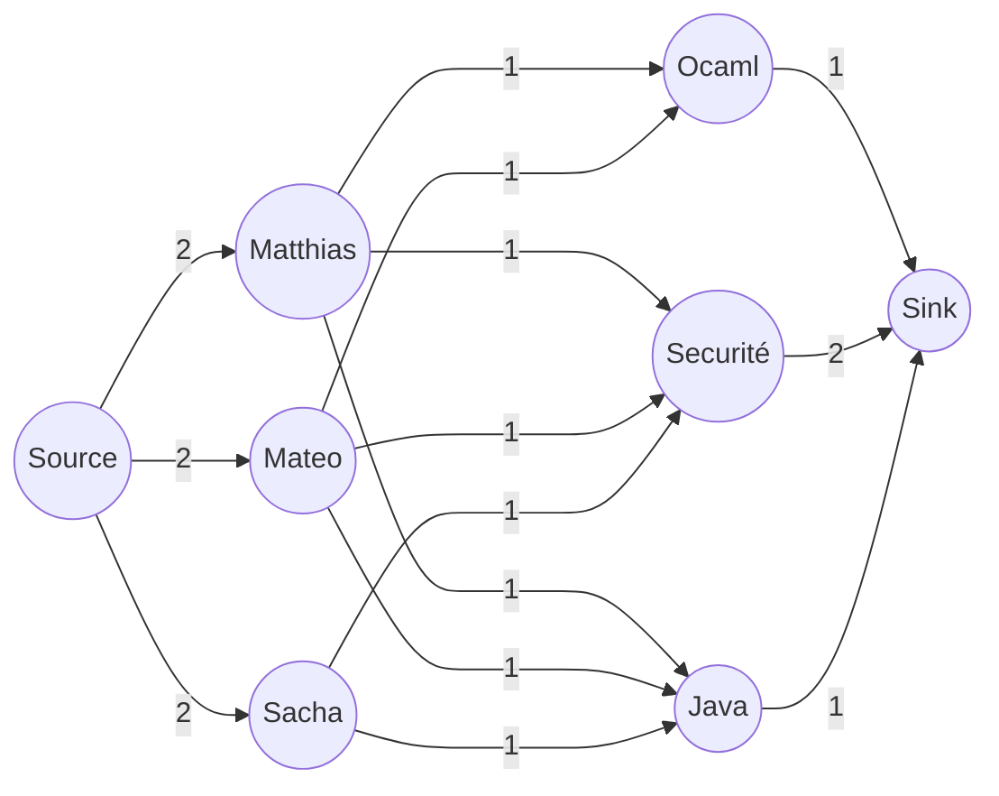
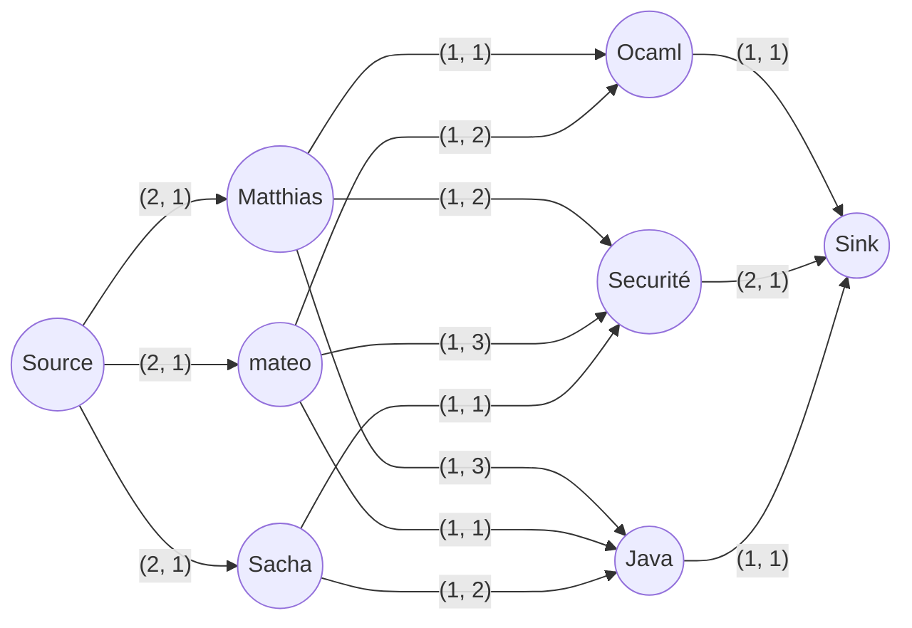

# Minimum weight bipartite matching in Ocaml

This school project's goal is to implement the Ford-Fulkerson algorithm in Ocaml and to apply it to a real-life problem. 
We chose to apply it to the minimum-cost bipartite matching problem.
It can easily be used to assign candidates with limited availability to ressources with limited quantity given a preference ranking.

## Example application

Let's say we have 3 courses with limited spots, and 3 students with a limited number of courses they can take.
Each of these students can rank the courses they want.

We first want to maximize the number of student-course assignations.
Multiple configurations with the same number of assignations may exist.
We want to choose the one which minimizes the total cost. 

```
% 3 classes with a 1, 1, and 2 spots respectively
v Ocaml 1
v Java 1
v Secu 2

% 3 students who can take at most 2 courses

u Matthias 2
u Mateo 2
u Sacha 2

% Course requests and rankings (costs)
e Matthias Ocaml 1
e Matthias Secu 2
e Matthias Java 3

e Mateo Java 1
e Mateo Ocaml 2
e Mateo Secu 3

e Sacha Secu 1
e Sacha Java 2

```

In this situation, the optimal way to assign the classes is:
```bash
./btest.exe bipartites/bipartite_readme.txt outfile
# outfile:
# Matthias -> Secu
# Matthias -> Ocaml
# Sacha -> Secu
# Mateo -> Java
```

Each student gets their top pick, and the remaining spot in the security course is assigned to Matthias, who ranked it higher than mateo.

## Explanation

The standard max-flow algorithm can easily be used to solve an unweighted bipartite problem, by converting the problem into a graph like this:

(Values from previous example, ignoring rankings)

Values on arrows are the capacity of the edge.



We can see that solving this graph for max-flow will solve the bipartite problem.

The capacity between the source and the candidates represents the number of ressources they can have, and the capacity between the ressources and the sink represents the number candidates they can be assigned to.

In this example, there are multiple configurations which maximize the flow, we must therefore introduce a cost for the edges between candidates and ressources.

In the following example, the second value on each arrow is the cost. (capacity, cost)



Solving this graph for max-flow-min-cost allows us to choose the most optimal configuration.

## Note about max-flow-min-cost

There are multiple definitions for max-flow-min-cost:
- Minimize the sum of edge_cost * edge_flow for the whole graph. This requires negative costs to be useful (otherwise will always return 0).
- Maximize the flow in the configuration where sum of edge_cost * edge_flow is minimal. This is better suited for our application.

## Ressources

https://cp-algorithms.com/graph/min_cost_flow.html
 
